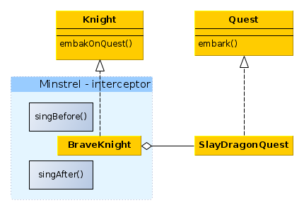
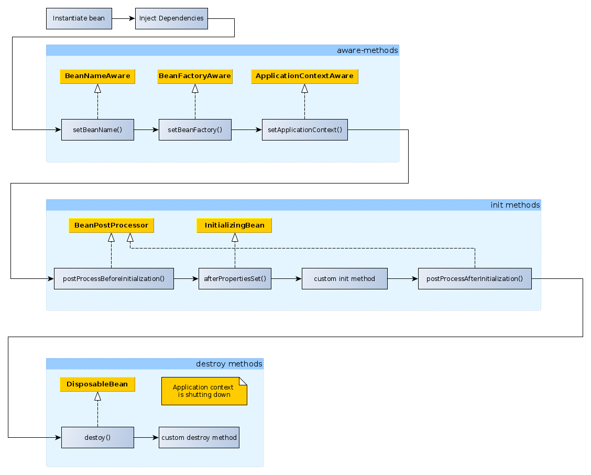
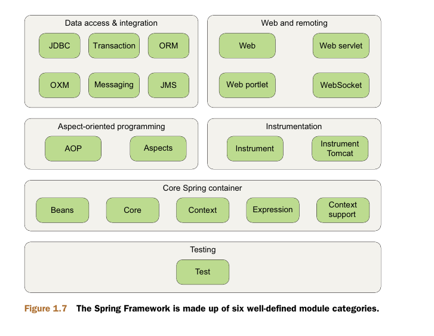

* wiring - это создание связей между компонентами приложения.
* app context - это объект, загружающий определения бинов и связывающий их между собой.
* Knight может выполнить quest, spring связывает экз. классов на основе программной или xml-конфигурации.
* Minstrel - это перехватчик, его методы выполняются до и после похода рыцаря в квест.
* IoC - Inversion of Control - бины создаются и управляются контейнером.
* DI - Dependency Injection - зависимости внедряются контейнером.

 

* Цикл жизни бина:
 
## Пользовательские методы, выполняемые при создании и уничтожении бина.
* Для scope=prototype destroy-методы не вызываются контейнером! Пользователь бина сам должен вызвать его destroy-методы.
* Инжекция в конструктор и вызов пользовательсктх методов создания и уничтожения бина в XML:
```xml
<bean id="myFortuneService" class="com.luv2code.springdemo.HappyFortuneService">
    </bean>
     <!-- custom init and destroy methods -->
    <bean id="myCoach"
          class="com.luv2code.springdemo.TrackCoach"
          scope="singleton"
          init-method="doMyStartupStuff"
          destroy-method="doMyCleanupStuff">
          <!--constructor dependency injection -->
        <constructor-arg ref="myFortuneService"/>

    </bean>
```
* Кастомные методы, выполняемые после создания бина и перед его уничтожением аннотируются через (без XML):
```java
@PostConstruct
@PreDestroy
```
* Пользовательские методы инициализации и уничтожения бина могут иметь любой модификатор и могут возвращать значение, но не могут иметь параметров.
* Аннотации @PostConstruct и @PreDestroy начиная с версии java9 не входят в состав jdk, нужно добавить
библиотеку javax.annotation-api-1.2.jar
* Основные модули Spring:

* По умолчанию бины в spring являются синглетонами.
* Можно инжектировать бин в метод, по имени бина (если бины создаются в configuration имя бина = имя метода
  создающего бин). А можно уточнить инжектируемый бин используя квалификатор.
