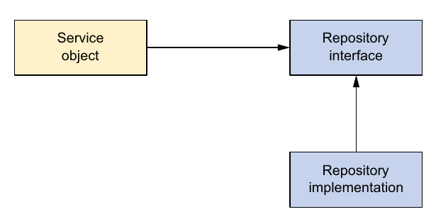
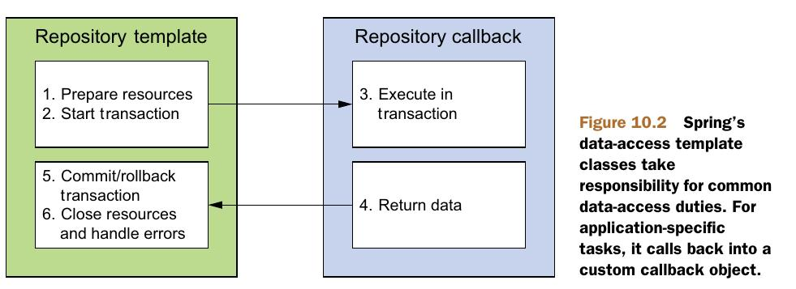
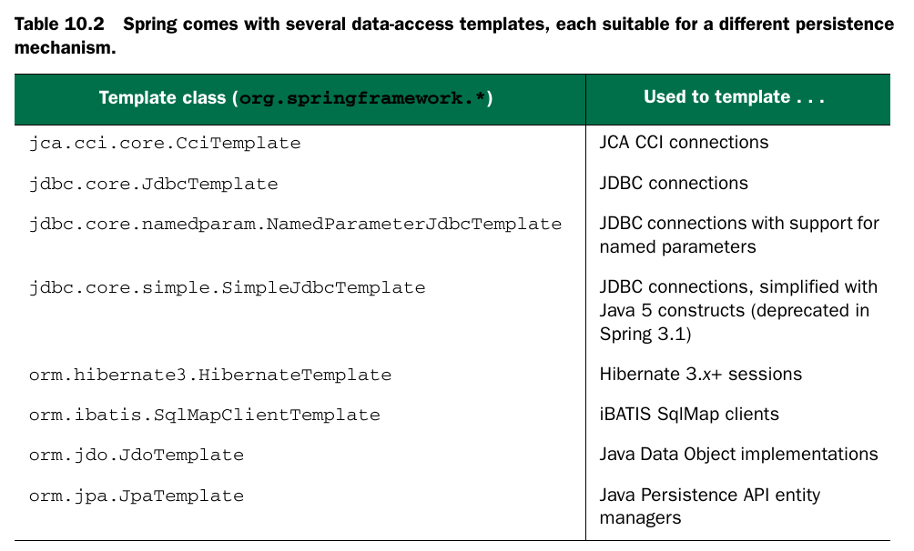
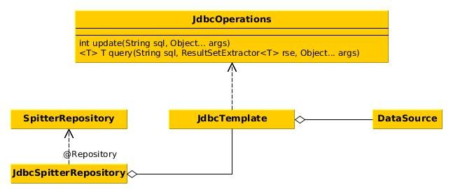

# JDBC in spring
* Слой доступа к данным отделен от других частей
через использование интерфейсов:

* <b>@Repository</b> - этой аннотацией аннотируются классы слоя доступа к данным. Это разновидность @Component.
Для этих классов осуществляется DataAccessException translation.
* Шаблоны содержат стандартный повторяющийся код,
каллбеки содержат переменные части:


* Spring позволяет использовать различные пулы  
соединений а так же искать их в JNDI.
* Запустим встроенную БД H2, выполним указанные скрипты
и вернем DataSource к этой бд:
```java
@Bean
public DataSource dataSource() {
     return new EmbeddedDatabaseBuilder()
    .setType(EmbeddedDatabaseType.H2)
    .addScript("classpath:schema.sql")
    .addScript("classpath:test-data.sql")
    .build();
}
```

