# Spring JPA
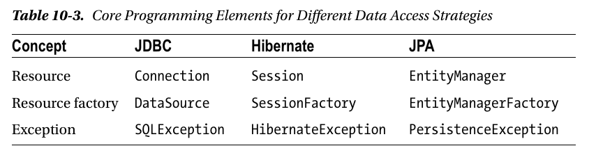
* EntityManager бывает
  1. Application-managed - приложение ответственно за создание EM старт и останов транзакций и тп.
  2. Container-managed - EM управляется контейнером.
* В любом случае spring будет сам управлять EM. В случае 1 - как приложение, в случае 2 - как контейнер.
Основное их различие - в способе конфигурации.
* App-managed EMF требуют наличия persistence,xml в META-INF.
* Независимо от способа создания можно инжектировать прокси EM.
```java
@PersistenceContext
private EntityManager em;
@PersistenceUnit
private EntityManagerFactory emf;
```
* Для декларативного управления транзакциями dao-класс аннотируется через
```java
@Transactional
```
* Следующая аннотация включает поддержку транзакций:
 @EnableTransactionManagement имеет 2 режима (mode):
  1. AdviceMode.PROXY(по умолчанию) - используется создание java-прокси для реализации транзакций
     только публичные методы будут транзакционными, вызов метода из того же класса не перхватывается.
  2. AdviceMode.ASPECTJ - используются spring-аспекты для транзакционности, любые методы перехватываются,
     вызовы методов из того же класса перехватываются.
```java
@EnableTransactionManagement
```
* Также в конфигурации должен быть определен бин для управления транзакциями:
```java
JpaTransactionManager
```
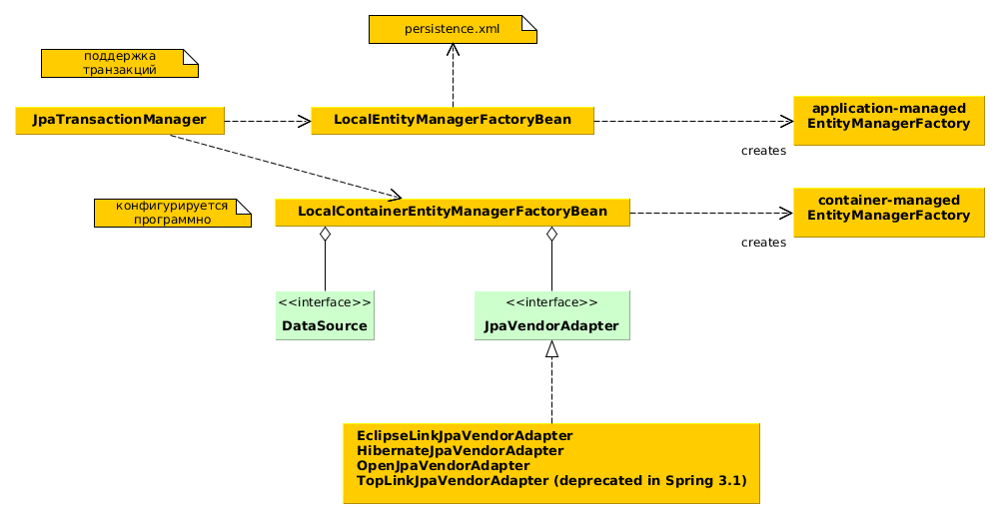
### Container-managed EntityManagerFactory
* конфигурируется программно, создается LocalContainerEntityManagerBean в который добавляется
DataSource и JpaVendorAdapter.
* DataSource можно создать или поискать в JNDI:
```java
@Bean
public DataSource dataSource() {
return new JndiDataSourceLookup().getDataSource("jdbc/VehicleDS");
}
```
* JpaVendorAdapter имеет свойство database которое может принимать значения:

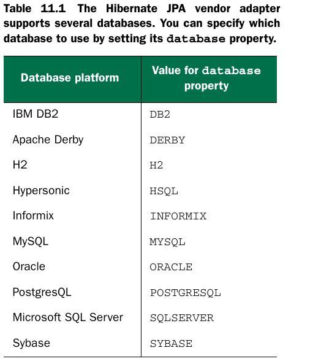

### Автоматическое создание репозиториев
```java
public interface SpitterAutoRepository extends JpaRepository<Spitter, Long> {
}
```
* В рантайме спринг имплементирует 18 хелпер-методов интерфейса JpaRepository.
* Класс сущности и первичного ключа указываются как параметры JpaRepository.
* Чтобы включить авто-имплементацию репозиториев нужно аннотировать конфиг.класс через
```java
@EnableJpaRepositories(basePackages="spitter.data")
```
* Спринг может автоимплементировать методы на основе их названий:
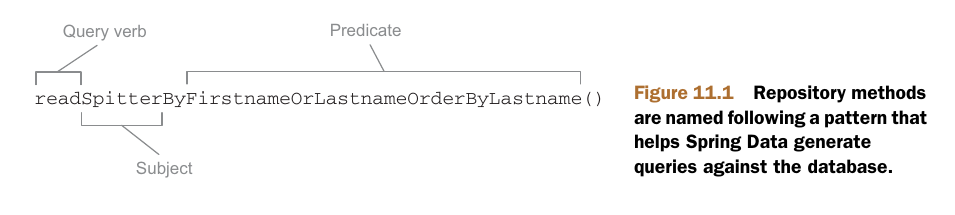
  1. всего можно использовать 4 глагола - read=find=get и count.
  2. Subject обычно не важен тк он уже определен в параметрах класса.
  3. Предикат следует за словом By и может иметь множество операторов,
  если оператор не указан (как в примере) то предполагается равенство.
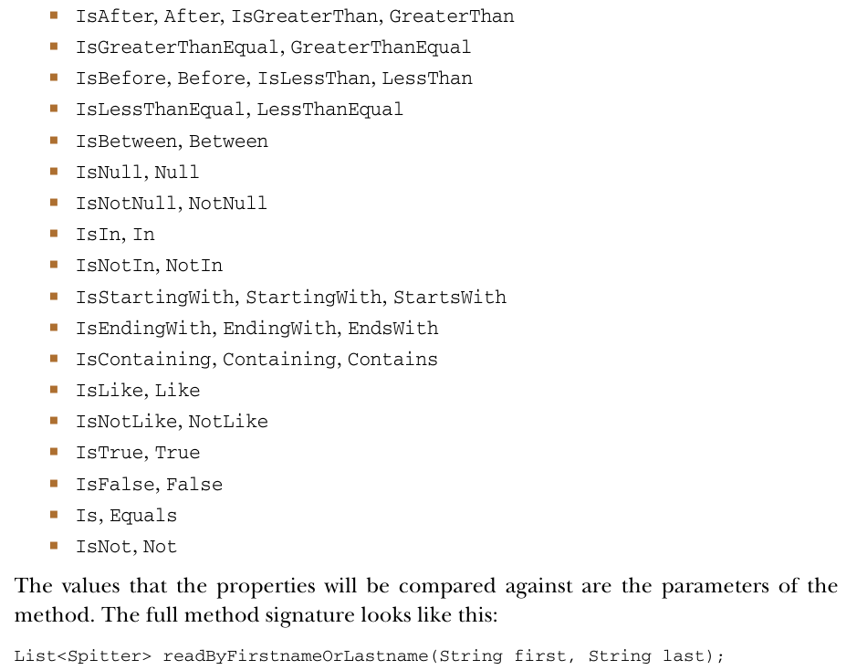

* Можно добавлять кастомные запросы в интерфейс используя @Query,писать имплементацию метода
так же не требуется.
```java
@Query("select s from Spitter s where s.email like '%gmail.com'")
List<Spitter> findAllGmailSpitters();
```
* Если @Query-аннотации не достаточно то можно создать класс InterfaceNameImpl и spring
автоматически добавит его методы к авто-генерируемым методам класса.

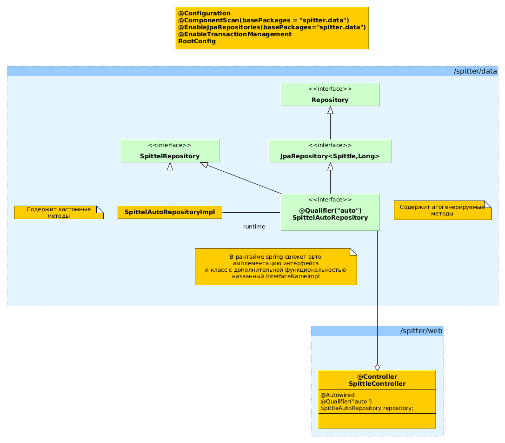

### Транзакции
* @Transactional позволяет указать свойста транзакции:
  1. Propagation = Required
  2. Isolation = уровень изоляции транзакции = isolation БД по умолчанию
  3. Транзакция может читать и писать
  4. Таймаут = таймаут в БД
  5. RuntimeException и наследники откатывают транзакцию, checked exceptions - не откатывают.
  6. value= "transactionManager" - имя бина или его квалификатор PlatformTransactionManager,
  то можно использовать несколько менеджеров транзакций в одном приложении.
* Все методы авто репозиториев аннотируются через @Transactional.

* Вызов метода из того же класса не приводит к созданию новой транзакции.
* Транзакции интегрируются автоматом с JdbcTemplate.
* @Transactional аннотируется весь класс либо публичные его методы - и только
публичные методы класса могут быть транзакционными.
* имя транзакции = полноеИмяКласса.названиеМетода.
* DataSourceTransactionManager - используется для JDBC - операций.

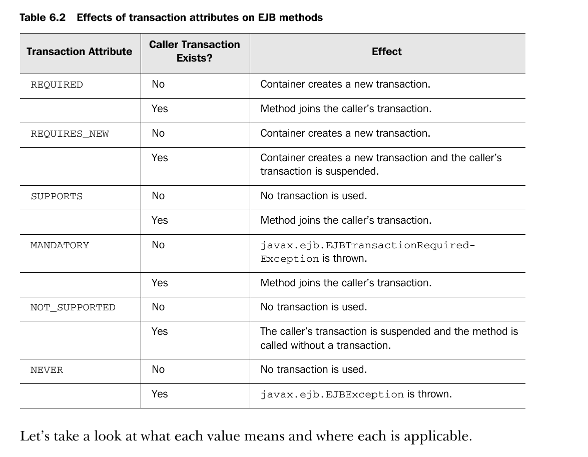
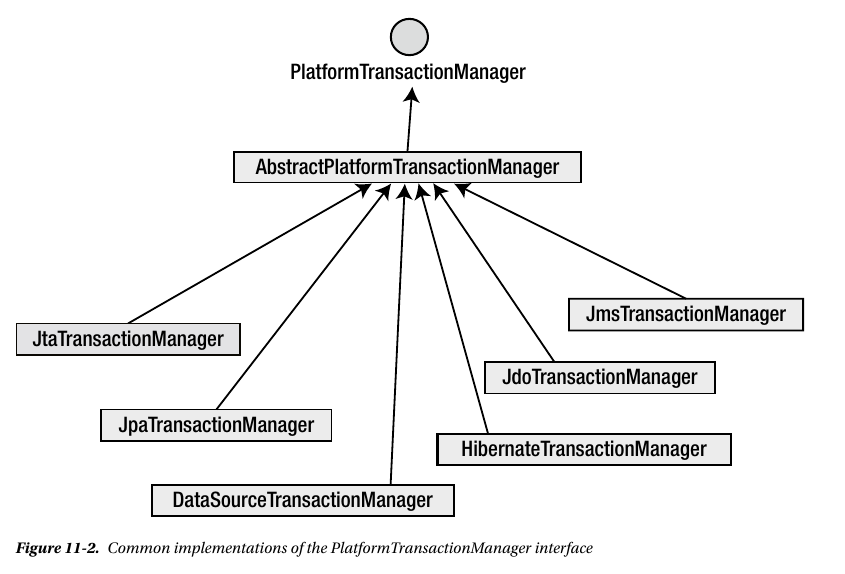
* PlatformTransactionManager имеет следующие методы:
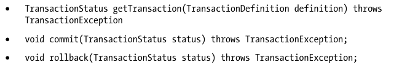
* TransactionTemplate - это класс для ручного управления транзакциями он автоматически
сохраняет или отменяет транзакцию (при выбросе исключения). Работает с интерфейсами
TransactionCallback<T> и TransactionCallbackWithoutResult. Откат транзакии осуществляется
при выбросе RuntimeException. (см JDBCSpittleRepository)
* Проблемы конкуррентных транзакций
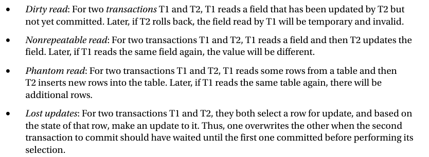
* Уровни изоляции транзацкий
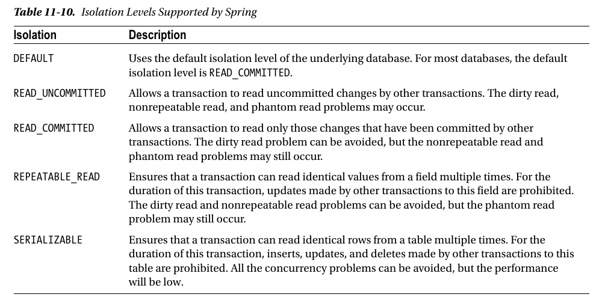
* Уровни изоляции и прочие аттрибуты транзакции выставляются в DefaultTransactionDefinition или в @Transactional
### Более одной бд
* для каждой бд создаем свой LocalContainerEntityManagerFactoryBean и указываем ему PUname.
* EntityManager инжектируется по имени PU(PersistenceUnit):@PersistenceContext(unitName = "PUname")
* TransactionManager аннотируется квалификатором и используется как @Transactional(transactionManager = "qualifier"). Можно так же использовать имя PlatformTransactionManager-бина.
