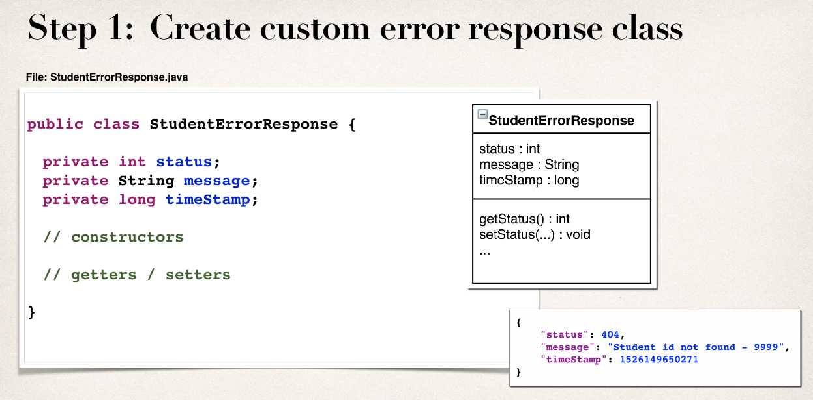

# REST


### ContentNegotiatingViewResolver
* ContentNegotiatingViewResolver  - это ViewResolver
который делегирует выбор представления другим резольверам, затем он формирует список всех доступных
View и выбирает один из них исходя из запрашиваемого типа содержимого:

  1. Если имя ресурса заканчивается на .html .xml .json то  выбирается соотв. View.
  2. View выбирается на основе заголовка Accept.
* ContentNegotiatingViewResolver конфигурируется с
помощью ContentNegotiationManager.
* Можно например сконфигурировать ContentNegotiatingViewResolver так, чтобы по умолчанию он выбирал text/html и т.о. обслуживать веб страницы и
Rest-сервисы.

* ContentNegotiatingViewResolver отобразит возвращаемые
данные как будто они добавлены в модель, т.е.
```json
List<Spittle> ->
{
    "spittleList": [
        {
            "id": 0,
            "message": "Some message 0",
            "date": 1488027200391
        }
      ]
}
```
### MessageConverters
* Можно изменить сериализацию ответа рест-метода и не
использовать для этого View и Model, а использовать MessageConverters напрямую. Для этого нужно аннотировать:

```java
@ResponseBody //аннотируем возвращаемое значение
@RequestBody //аннотируем тело запроса
@RestController //аннотируем весь класс
```
* ResponseEntity позволяет вернуть данные клиенту
и указать доп. параметры ответа - код состояния и
заголовки. Можно использовать для обработки ошибок
и указания url вновь созданного ресурса.


### Обработка ошибок
* Можно выбросить исключение в ресурс методе и перехватить его в методе обрабатывающем ошибку,
для этого метод-перехватчик аннотируетсчя через:
```java
@ExceptionHandler(SpittleNotFoundException.class)
```
* Можно перехватытвать все исключения и т.о. организовать обработчик исключений общего вида. В generic exceptionHandler попадут все не обработанные исключения:
```java
@ExceptionHandler
public ResponseEntity<StudentErrorResponse>handleException(Exception ex){
    StudentErrorResponse error = new StudentErrorResponse(HttpStatus.BAD_REQUEST.value(),
    ex.getMessage(), System.currentTimeMillis());
    return new ResponseEntity(error, HttpStatus.BAD_REQUEST);
}
```
* Обработку исключений можно организовать и так (maven/spring-rest-demo):





* Глобальная обработка исключений, не привязанная к конкретному контроллеру осуществляется через:

* В него перемещаются все методы аннотированные <b>@ExceptionHandler</b>:

* Этапы разработки rest-api (maven/spring-crm-rest-demo):


### Rest-клиент
* RestTemplate предназначен для посылки рест-запросов:
url с параметром:"http://graph.facebook.com/{spitter}"

```java
 <T> ResponseEntity<T> exchange(String url, HttpMethod method,
HttpEntity<?> requestEntity, Class<T> responseType,
Object... uriVariables) throws RestClientException;
```
* Response/RequestEntity содержат тело ответа/запроса и
http-заголовки.
* uriVariables подставляются вместо соотв. placeholderов в строке url.
### Релевантный код можно найти в:
* SpilttleRestController
* SpittleController
* RestClientExample
* SpringAndHibernate/maven/spring-rest-demo/
