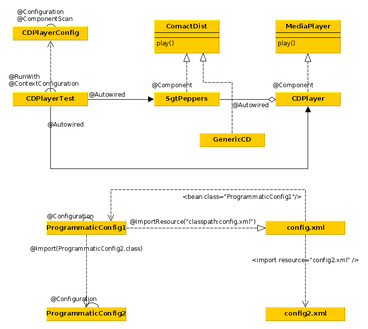

### Инстанциирование и связывание бинов на основе аннотаций.
* Бины маркируются @Component(["id бина, по умолчанию имя бина с малой буквы"])
* Вместо @Component можно использовать @Named
* Конфигурационный класс аннотируется через
@Configuration
@ComponentScan
* @ComponentScan позволяет:
1. указать имена пакетов, которые будут рекурсивно сканироваться на предмет наличия бинов.
По умолчанию сканирование будет в том же пакете, в котором располагается конфигурационный класс.
2. Можно так же указать набор классов - тогда их пакеты будут рекурсивно
отсканированы.
 ```xml
 <context:component-scan> аналог @ComponentScan в XML
 ```
* @Autowired - это аннотация, маркирующая точку внедрения.
* Вместо @Autowired можно использовать @Inject.
* При помощи аннотаци @Import(CDPlayerConfig.class) можно добавить программную
конфигурацию из другого класса,
```xml
<bean class="soundsystem.CDConfig" />
аналог в xml
```
* При помощи аннотации @ImportResource("classpath:config.xml") можно добавить
конфигурацию из хмл-файла,
```xml
<import resource="config.xml" /> аналог в xml.
```

