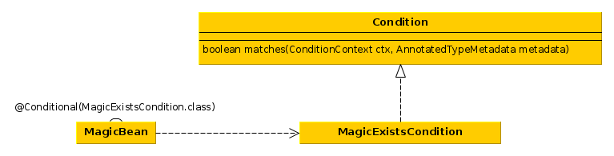
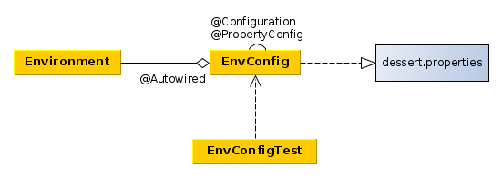

### Profiles
* Profile - это набор бинов.
* Каждый профиль имеет имя, при активации профиля
создаются его бины.
* В одну и ту же точку внедрения могут быть инжектированы
различные бины, в зависимости от активного профиля.
* @Profile("имя") - аннотация определяющая принадлежность бина
к именованному профилю.
* xml-аналог:
```xml
<beans profile="имя"/>
можно определить атрибут profile на корневом элементе beans,
а можно использовать вложенные элементы beans
```
* Выбор активного профиля определяется свойствами:
```java
//активные профили, профили по умолчанию выключаются
spring.profiles.active=profile1,profile2
//активные профили по умолчанию
spring.profiles.default=profile3,profile4
```
* Задавать эти свойства можно несколькими методами:
  1. Как переменные окуржения
  2. Как переменные jvm
  3. Как параметры сервлета
  4. @ActiveProfiles в тестах

### Создание бинов по условию
* Аннотация @Conditional(класс-наследник интерфейса Condition) позволяет
создавать или не создавать бин, в зависимости от условия, оперделяемого
в наследнике Condition.


### Выбор реализации бина
* @Primary - этой аннотацией снабжается реализация по умолчанию. Если
есть много реализаций бина, то @Primary инжектируется в отсутствии
дополнительной конфигурации.
```xml
аналог в xml -  аттрибут primary
```
* @Qualifier("id бина") - инжектировать бин по его имени или id,
Можно аннотировать сам бин и/или место инжекции бина. Имя бина и его id практически
одно и то же, имя и id должны быть уникальны. Если @Qualifier используется в и инжекции
через конструктор, то квалификатором нужно аннотировать инжектируемый параметр:
```java
@Autowired
public SomeClass(@Qualifier("someDependency")SomeDependency dep){
  ...
}
```
* Можно создать кастомную аннотацию-квалификатор и аннотировать
ей бин и место его внедрения.


### Область видимости бина
* Спринг имеет следующие области видимости бина:
  1. Singleton — One instance of the bean is created for the entire application.
  Область видимости по умолчанию.
  2. Prototype — One instance of the bean is created every time the bean is injected
into or retrieved from the Spring application context.
```java
@Scope(ConfigurableBeanFactory.SCOPE_PROTOTYPE)
//можно задавать область видимости строкой
@Scope("prototype")
```
```xml
<bean id="notepad"
class="com.myapp.Notepad"
scope="prototype" />
```
  3. Session—In a web application, one instance of the bean is created for each session.
```java
@Scope(
  value=WebApplicationContext.SCOPE_SESSION,
  proxyMode=ScopedProxyMode.INTERFACES)
```
Аттрибут proxyMode определяет какого типа прокси нужно создавать (можно инжектировать
Session bean в Singleton и тогда без прокси не обойтись).proxyMode бывает:
    1. INTERFACES если бин инжектируется по интрефейсу, то создается реализация этого
    интерфейса, которая проксирует вызовы до
    экземпляра бина.
    2. TARGET_CLASS если бин инжектируется без
    интерфейса и проски нужно создать для самого
    класса бина.
  4. Request—In a web application, one instance of the bean is created for each
request.

### Environment
* Environment - это класс, позволяющий :
  1. получать информацию об активных\дефолтовых профилях
  2. получать значения параметров из файла свойств.

  
* Значения свойств из environment доступны в spring
 при помощи ${имя-свойства}. Чтобы использовать, нужно:
    1. Добавить в программную конфигурацию бин
    PropertySourcesPlaceholderConfigurer (спринг >=4.3 работает и без него)
    или в xml
    ```xml
      <context:property-placeholder/>
    ```
    2. Аннотировать параметры конструктора\метода или поле
    через @Value("${имя.свойства}") или в xml
    ```xml
      value="${имя.свойства}"
    ```
* Можно инжектрировать все свойста из файла свойств как Map<String,String>:
```Java
    //создаем в конфигах новый бин
    @Bean(name = "mapper")
    public PropertiesFactoryBean mapper() {
        PropertiesFactoryBean bean = new PropertiesFactoryBean();
        bean.setLocation(new ClassPathResource("dessert.properties"));
        return bean;
    }
    //инжектируем все свойства как Map
    @Value("#{mapper}")//инжекция бина по его имени, используя SpringEL
    @Getter
    private Map<String,String>properties;
```
* инжекция свойств из файла свойств
```xml
<!-- acessing properties file -->
   <context:property-placeholder location="classpath:sport.properties"/>
   <bean id="myFortuneService" class="com.luv2code.springdemo.HappyFortuneService">
   <bean id="myCricketCoach" class="com.luv2code.springdemo.CricketCoach">
           <!-- setter injection -->
           <property name="fortuneService" ref="myFortuneService"/>
           <!-- injecting literal values, referencing properties from sports.properties -->
           <property name="emailAddress" value="${foo.email}"/>
           <property name="team" value="${foo.team}"/>

       </bean>
```
sport.properties:
```properties
foo.email=arbocdi@gmail.com
foo.team=Royal Challengers
```
### SpEL

* SpEL - Spring Expression Language
```
#{...}
```
* Константы:
```java
#{true} boolean
#{false} boolean
#{'string'}
#{123} integer
#{1.3}  float
```
* Переменные окружения
```java
#{systemProperties['property.name']}
```
* Оператор T() дает доступ к статическим методам и свойствам
указанного класса.
```java
#{T(System).currentTimeMillis()} - текущее время.
#{T(java.lang.Math).PI} - значение пи
```
* Бины, их свойства и методы
```java
#{sgtPeppers.artist} - доступ к свойству
#{bean.method()} - доступ к методу
#{bean.name()?.toUpperCase()} - вернуть имя в верхнем регистре,
?. - не вызывать метод toUpperCase(), если name() вернул null
```
#### Операторы

* Результат теста на регулярное выражение возвращает true\false:
```java
#{user.name matches '\\w+'}
```
* Работа с коллекциями:
```java
#{jukebox.songs[4].title} //вернуть заголовок 5-ой песни
#{'This is a test'[3]} //выбрать 4-ый символ -> s
#{jukebox.songs.?[artist eq 'Aerosmith']} // .?[] выбрать подмножество
//по условию в скобках, в данном случае выбираются все песни исполнителя
//Aerosmith
//.^[] вернуть первый подходящий объект
//.$[] вернуть последний подходящий объект
```
* Projection operator .![]
```java
#{jukebox.songs.![title]} //вернуть коллекцию из заголовков песен
```
