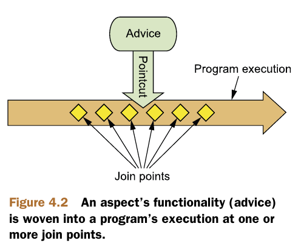
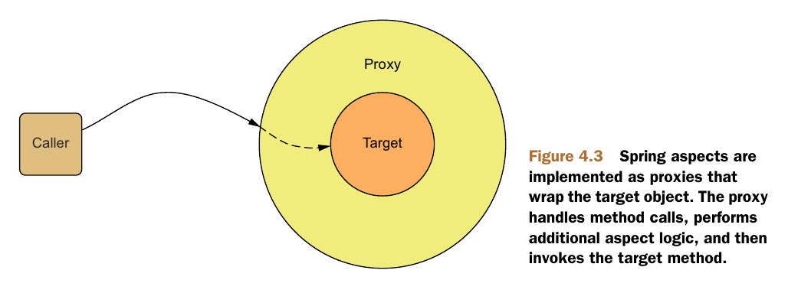
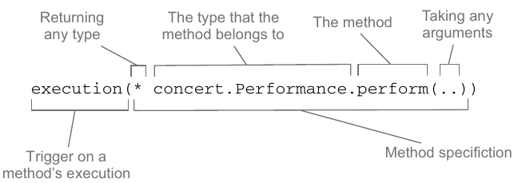
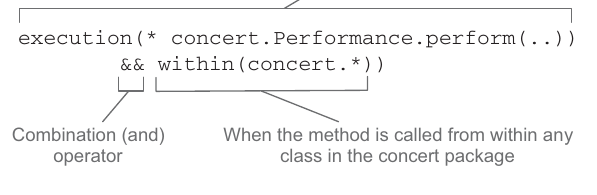
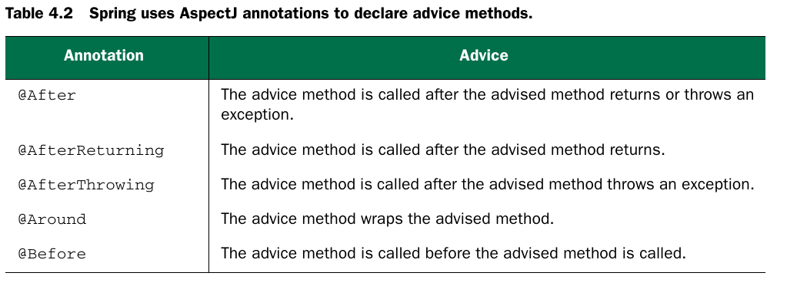
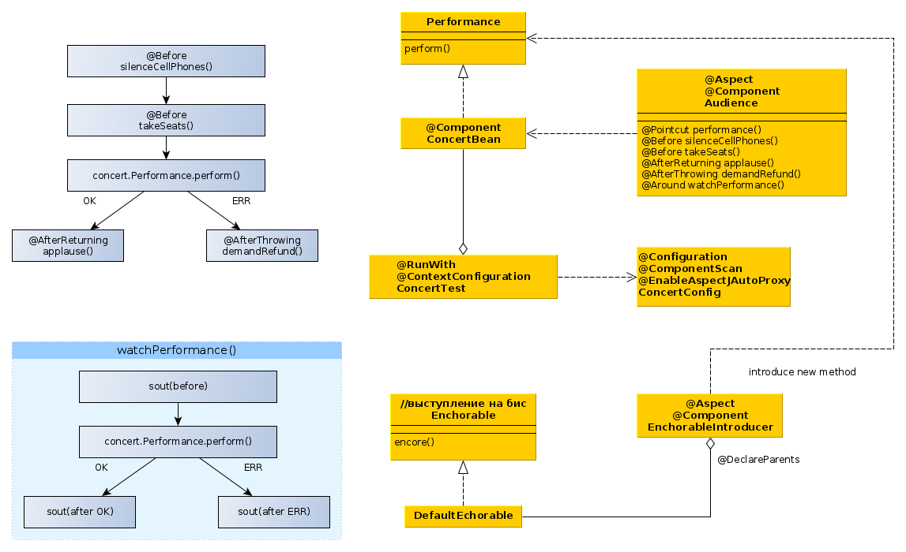
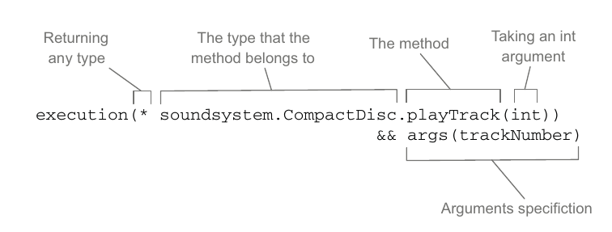
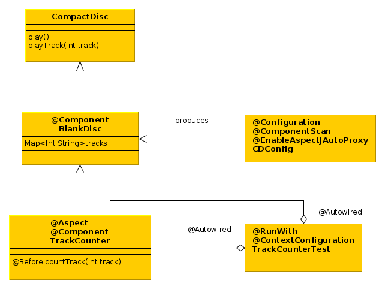
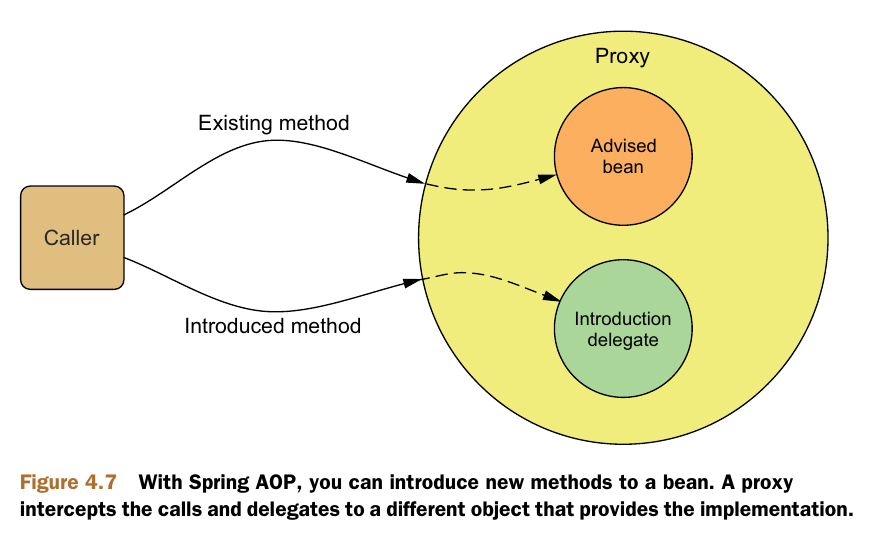

* cross-cutting concerns (сквозная функциональность) - это действия,
выполняемые во многих местах системы для решения одних и тех же задачь
(напр. логгирование, обработка исключений и пр).
* advice (совет) - какие действия нужно выполнить, когда их нужно выполнить
(до вызова метода, после вызова метода, до и после, только если выброшено искл и пр.).
* join points - это все точки выполнения программы, где можно применить совет
(вызов метода, изменение поля и т.п.).
* pointcuts - это набор join point в которых применяется данный совет.
* аспект = совет+pointcuts

* introduction - это добавление новых методов и аттрибутов в существующие классы.
* weaving - это процесс применения аспектов к объектам, в spring создается новый прокси-объект, содержащий
аспект и собственно рабочий объект.

### Pointcuts (выборки join points)

* П: выберем точку внедрения по:
  1. Полному имени класса (concert.Performance)
  2. Имени метода
  3. Возвращаемый тип - любой
  4. Тип аргументов - любой

* П: используя указатель within ограничим выборку точек
внедрения, будем перехватывать метод только если он вызывается из любого класса в пакете concert:

* В aspectJ выборках можно использовать булевые
операторы:
```java
&& and
|| or
! not
```
* Указатель bean позволяет опеределить аспект только
при вызове метода бином с определенным id:
```java
execution(* concert.Performance.perform())
            and bean('woodstock')
```
### Советы


* @EnableAspectJAutoProxy  - это аннотация, включающая
автопоиск аспектов, аналог в xml:
```xml
<aop:aspectj-autoproxy/>
```


* В советы можно передавать параметры:




### Добавление новых методов и свойств
* Spring AOP позволяет добавлять новые методы в существующие бины, при вызове дополнительного метода
прокси-объект пробрасывает вызов на другой объект,
т.о. получается, что один бин состоит из множества
объектов.


