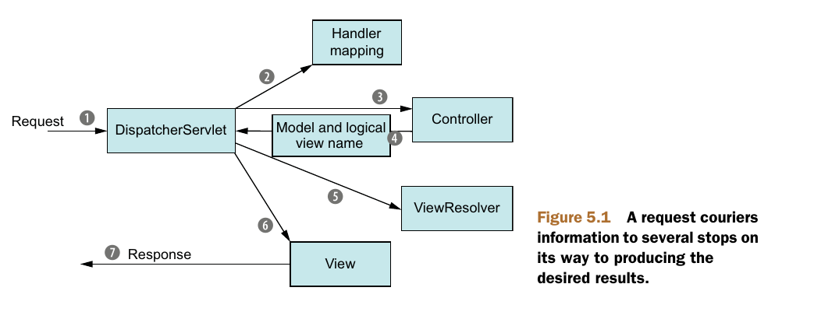
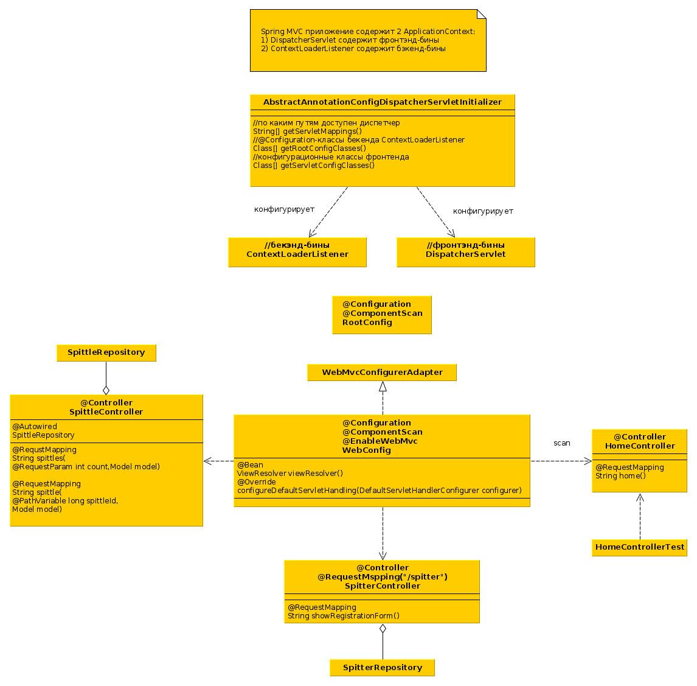
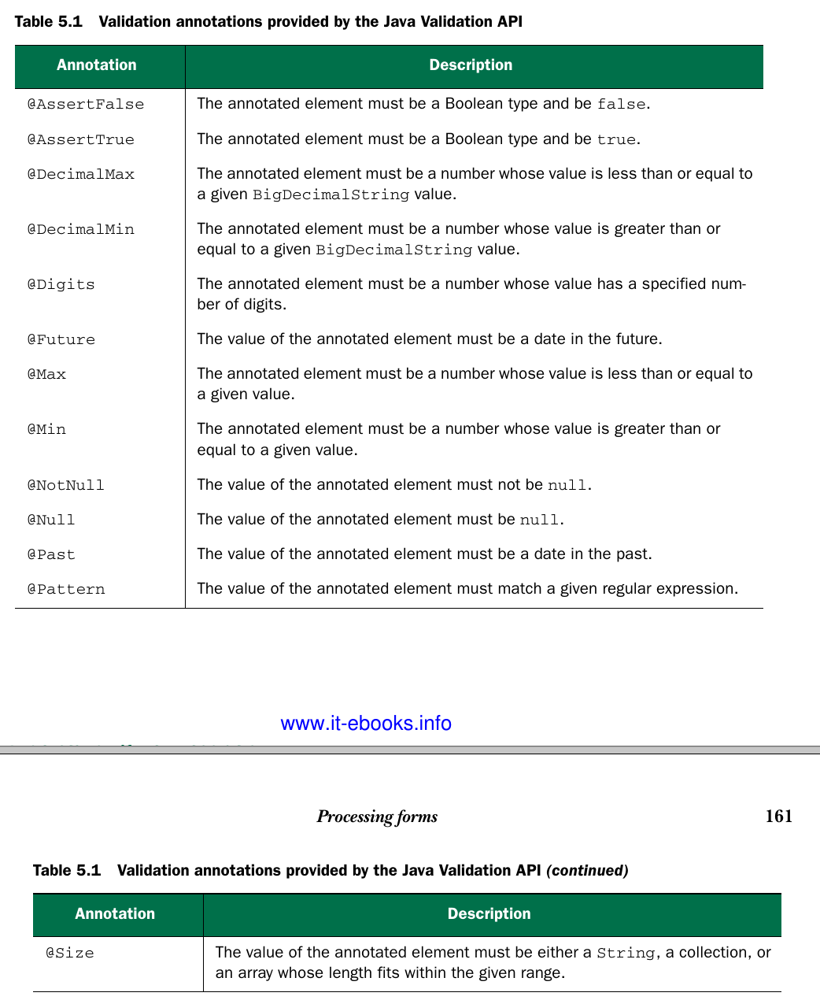

### Spring MVC

1. DispatcherServlet - это единая точка входа в спринг
приложение. В него попадают все запросы клиентов.
2. DispatcherServlet консультируется с набором
HandlerMapping чтобы определить какой Controller  должен
обработать запрос.
3. Controller использует данные запроса и модель чтобы
обработать запрос.
4. Контроллер возвращает модель (отображаемые
пользователю данные) и имя представления, которое будет
отрисовывать модель.
5. DispatcherServlet консультируется с ViewResolver,
чтобы найти нужный view по его имени. Т.о. контроллер и
представление полностью разделены.
6. Выбранный view использует модель чтобы сформировать
html-ответ клиенту 7.

### Configure DispatcherServlet
* ContextLoaderListener создает ApplicationContext,
доступный всем DispatcherServletам (если их несколько),
DispatcherServlet создает вложенный AppCtx, содержащий
контроллеры, ViewResolvers и прочее (веб бины).

* Spittr - это веб приложение типа твиттера, spitters -
это пользователи приложения, а spittlets - это краткие
обновления статусов пользователей.
* Controller - это бин аннотированный @Controller,
методы бина аннотируются через @RequestMapping, которая
определяет какие пути обслуживает данный контроллер. Controller это подвид @Component.
* Model - это набор пар ключ-значение, передаваемых
представлению. Вместо model можно использовать обычный
Map.
* В представлении данные модели доступны через JSTL
как параметры запроса ${spittleList}
* Способы передачи данных в контроллер:

    1 При помощи параметров запроса:

  ```java
  @RequestParam(name = "count",defaultValue = "2")
  int count
  ```
    @RequestParam можно использовать для получения данных формы.

     2 При помощи параметров адреса:

  ```java
  @RequestMapping(path = "/spittles/{spittleId}",
  method = RequestMethod.GET)
  //GET /spittles/12345
  public String spittle(
      @PathVariable("spittleId") long spittleId,
      Model model) {
        ...}
  ```
    Если @RequestMapping указана на контроллере, то все методы будут иметь префикс пути равный пути контроллера.

    3 Можно напрямую использовать HttpServletRequest:
  ```java
  public String register(HttpServletRequest request) {
    ...
  }
  ```


  * Если в @RequestMapping не указан метод, то все HTTP-методы будут обслуживаться этим методом контроллера.
  ### доступ к данным в jsp
  * ${param.studentName} - получить параметр запроса studentName
  * ${modelAttrName} - получить доступ к объекту модели.
  ### доступ к статическим ресурсам
  * JSP EL-expression ${pageContext.request.contextPath} используется для получения корня веб-приложения. Например загрузка рисунка:
  ```html
  
  ```
  В xml-конфигурации следует указать располождение статических ресурсов относительно каталога webapp <b>location</b> и путь, по которому эти ресурсы будут доступны <b>mapping</b>:
  ```xml
  <mvc:resources mapping="/resources/**" location="/resources/"></mvc:resources>
  /** означает поиск ресурсов в поддиректориях  
  ```
  Аналогичная конфигурация в java WebMvcConfigurerAdapter:
  ```Java
  @Override
  public void addResourceHandlers(final ResourceHandlerRegistry registry) {
       registry.addResourceHandler("/resources/**").addResourceLocations("/resources/");
  }
  ```
  * Переопределяя метод configureDefaultServletHandling() WebMvcConfigurerAdapter
  ```Java
  @Override
  public void configureDefaultServletHandling(DefaultServletHandlerConfigurer configurer) {
      configurer.enable();
  }
  ```
 мы делегируем все необработанные запросы дефолтному сервлету контейнера, который обычно обслуживает статическое содержимое. В этом случае не надо дополнительно определять <b>mvc:resources</b> или <b>addResourceHandlers</b>.Это нужно, если DispatcherServlet зампелен на путь "/" т.к. он тогда начинает обслуживать все содержимое веб приложения, затирая дефолтный сервлет.

  ### validators

  * Spring 3.0 поддерживает Java Validation API в
  spring MVC, чтобы использовать апи, нжно:
    1. Добавить в cp реализацию апи
    2. Аннотировать параметры Spitter спец. аннотациями.
    3. Внести изменения в метод регистрации.


