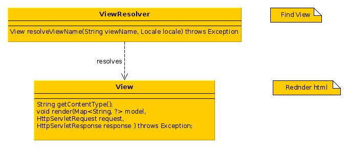
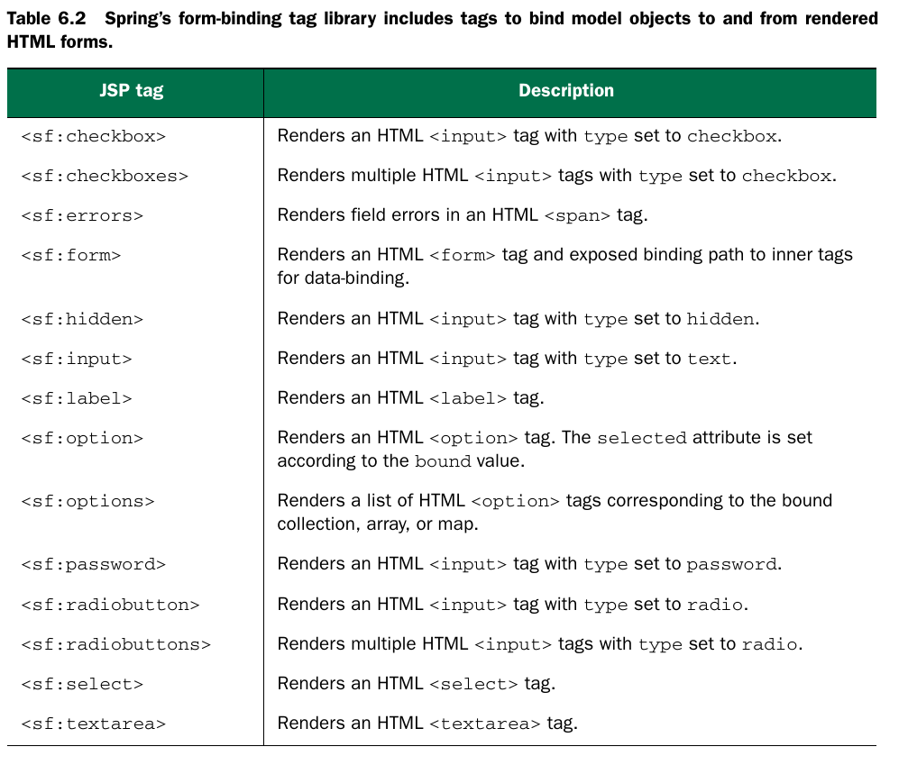
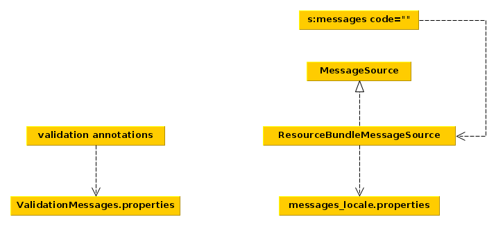

### Views
* По умолчанию InternalResourcesViewResolver возвращает экземпляры
InternalResourceView, который подходит для визуализации JSP. Если
требуется в спринг сконфигурировать локаль и выводимые пользователю
сообщения, то нужно использовать JstlView:



### Form-binding tag library
* Используется для привязки формы и её элементов к объектам модели,
подключение:sf = spring forms
```java
<%@ taglib
 uri="http://www.springframework.org/tags/form"
 prefix="sf" %>
```


* sf:errors можно использовать, чтобы показать
 сообщения валидации для всех полей:

 ```java
 <sf:errors cssClass="error" path="*" element="div"/>
 ```


 * или только для одного поля:
  ```java
 <sf:errors cssClass="error" path="firstName"/>
 ```


 * sf:label выводит label для соотв. поля (path), если
 указать cssErrorClass то покажет ошибку валидации:
 ```java
 <sf:label path="lastName" cssErrorClass="error">
 Last Name:
 </sf:label>
 ```


 * ошибки валидации можно определить в аннотациях:
 ```java
 @Size(min=2, max=30, message="{firstName.size}")
 ```
 * а сами сообщения в файле
  ValidationMessages.properties

  ### General tags library
```java
  <%@ taglib
  uri="http://www.springframework.org/tags"
  prefix="s" %>
```

* s:messages позволяет получать текстовки из файлов
свойств:
```java
<s:message code="spittr.welcome" />
```
* нужно также сконфигурировать ResourceBundleMessageSource - класс,читающий
интернационализированные файлы свойств из classpath.



### Apache Tiles
* Нужно сконфигурировать TilesConfigurer - бин,
загружающий шаблоны и TilesViewResolver - бин,
загружающий представления.
