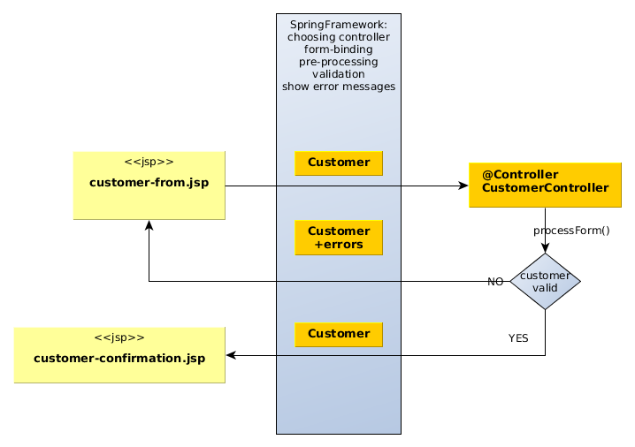
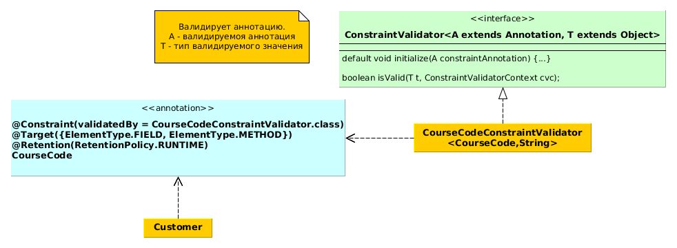

### Views
* По умолчанию InternalResourcesViewResolver возвращает экземпляры
InternalResourceView, который подходит для визуализации JSP. Если
требуется в спринг сконфигурировать локаль и выводимые пользователю
сообщения, то нужно использовать JstlView:


### Form-binding tag library
* Используется для привязки формы и её элементов к объектам модели,
подключение:sf = spring forms
```java
<%@ taglib
 uri="http://www.springframework.org/tags/form"
 prefix="sf" %>
```
* В форме можно указать аттрибут modelAttribute="student" и в контроллере инжектировать экз. Student через:
```Java
@ModelAttribute("student") Student student
```
аттрибуты path в spring-тегах связывают элементы формы с полями класса Student. При показе формы следует положить пустой экз. Student в model.


### Form Validation
* sf:errors можно использовать, чтобы показать
 сообщения валидации для всех полей:

 ```java
 <sf:errors cssClass="error" path="*" element="div"/>
 ```


 * или только для одного поля:
  ```java
 <sf:errors cssClass="error" path="firstName"/>
 ```


 * sf:label выводит label для соотв. поля (path), если
 указать cssErrorClass то покажет ошибку валидации:
 ```java
 <sf:label path="lastName" cssErrorClass="error">
 Last Name:
 </sf:label>
 ```

 * ошибки валидации можно определить в аннотациях:
 ```java
 @Size(min=2, max=30, message="{firstName.size}")
 ```
 * а сами сообщения в файле
  ValidationMessages.properties

 * Java-код метода валидации (BindingResult идет строго следующим параметром после валидируемого объекта):

 ```Java
 //CustomerController,spring-mvc-demo2
 /**
    @param customer
    @param bindingResult хранит информацию о валидации
    @return view name
     */
    @RequestMapping("/processForm")
    public String processForm(
            @Valid @ModelAttribute("customer") Customer customer, BindingResult bindingResult) {
        if (bindingResult.hasErrors()) {
            return "customer-form";
        } else {
            return "customer-confirmation";
        }
    }
 ```

* Метод аннотированный через @InitBinder будет осуществлять пре-процессинг всех запросов, идущих в контроллер. Метод выполняется до валидации.
* См примеры валидации в проекте spring-mvc-demo2:

* Вместе с аннотацией @NotNull нужно использовать обертки для примитивных типов, чтобы получить нужное сообщение об ошибке.
  ### General tags library
```java
  <%@ taglib
  uri="http://www.springframework.org/tags"
  prefix="s" %>
```

* s:messages позволяет получать текстовки из файлов
свойств:
```java
<s:message code="spittr.welcome" />
```
* нужно также сконфигурировать ResourceBundleMessageSource - класс,читающий
интернационализированные файлы свойств из classpath. Имя(id) бина должно быть messageSource.

* Внутри файла свойств можно переопределять стандартные сообщения об ошибках, например ошибка конвертации строки в Integer в аттрибуте модели customer и его поле freePasses:
```properties
#code.modelAttributeName.fieldName
typeMismatch.customer.freePasses=Invalid number
```
* Ошибки валидации вместе с названиями сообщений и самими дефолтными сообщениями валидации можно получить распечатав объект <b>BindingResult</b>.

* <b>Custom validation</b>
  1. Создать кастомную валидирующаю аннотацию.
  2. Создать валидатор для аннотации.
  3. Аннотировать нужные поля новой аннотацией.


  


### Apache Tiles
* Нужно сконфигурировать TilesConfigurer - бин,
загружающий шаблоны и TilesViewResolver - бин,
загружающий представления.
