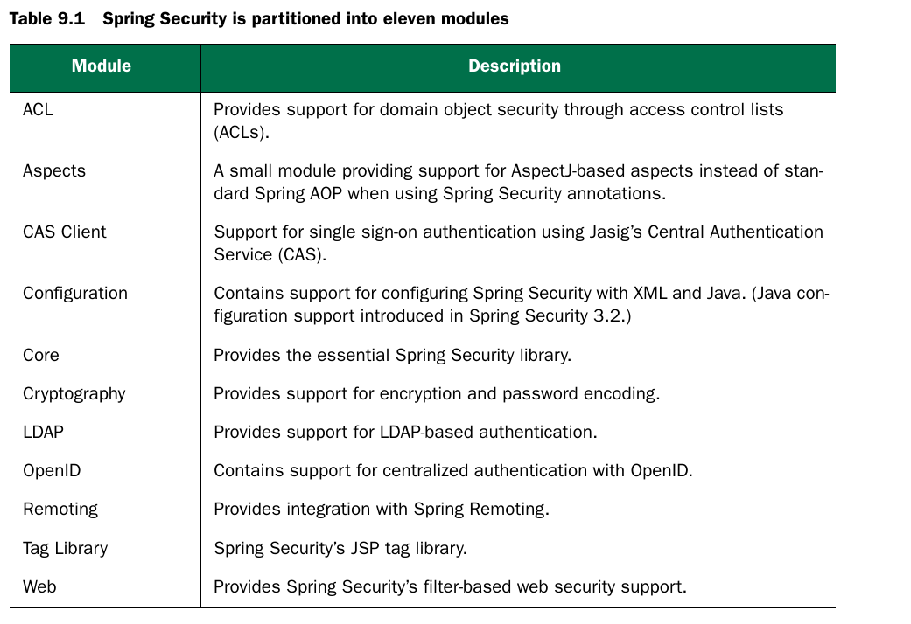
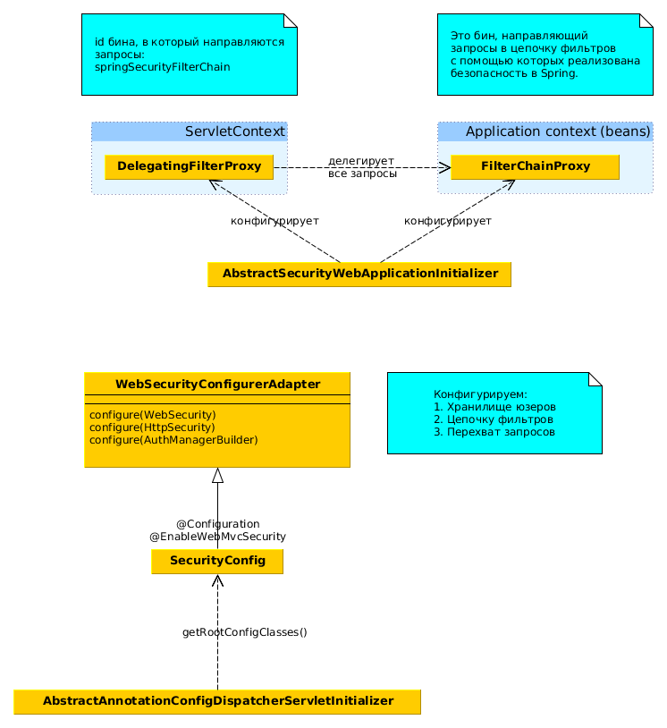
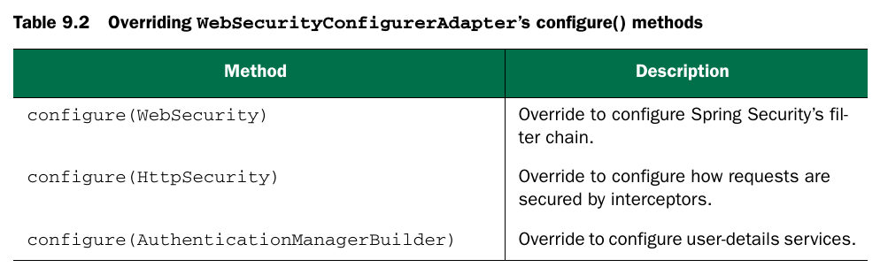
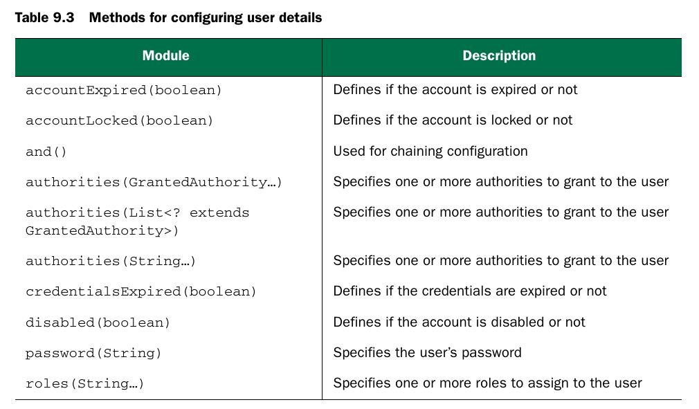
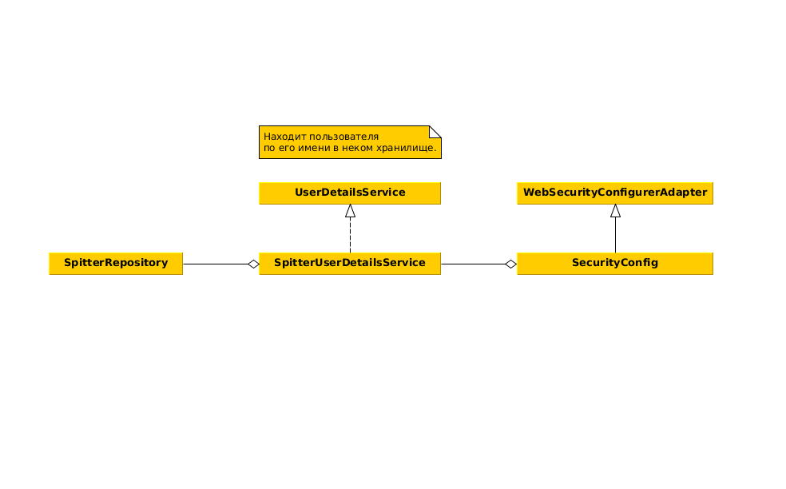
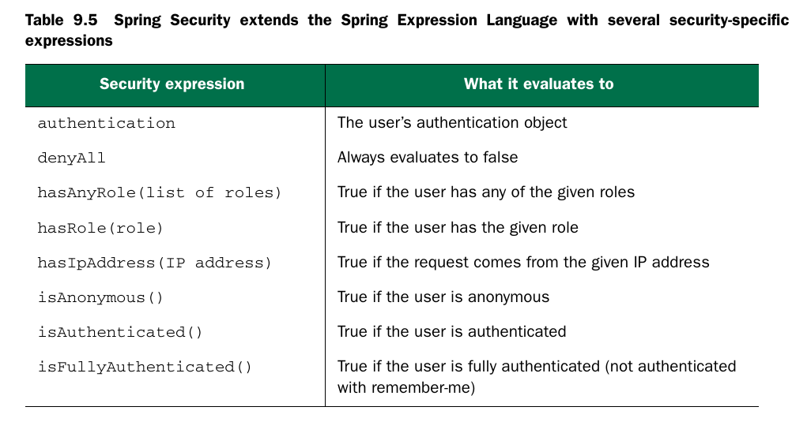
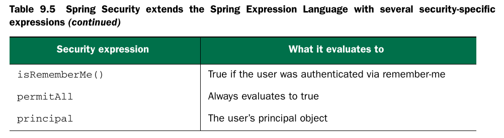

# Web secutiry

*  Для веб-приложения нужно добавить в CP: core,configuration,web.
* Principal - главный, основной - это некая сущность - пользователь, сервис, устройство.
* Web-безопасность в спринг реализована
как набор web-фильтров. DelagatingFilterProxy направляет
все запросы в специальный бин (id = springSecurityFilterChain), в качестве которого обычно
выступает FilterChainProxy.
* FilterChainProxy направляет запрос в цепочку secutiry
фильтров Spring.

* DelagatingFilterProxy конфигурируется либо в web xml,
либо программно.
* Конфигурируем security в WebMvc-приложении:
```java
//конфигурация аутентификации и авторизации
@Configuration
@EnableWebMvcSecurity
//@EnableWebSecurity
public class SecurityConfig extends WebSecurityConfigurerAdapter {
}
//конфигурация фильтров безопасности спринг
public class SecurityWebAppInitializer
   extends AbstractSecurityWebApplicationInitializer {
}
```

* Возможно хранить аутентификационные данные в памяти (см код SecurityConfig), методы хранилища в памяти:

* Role это GrantedAuthority с префиксом ROLE_
* GrantedAuthority это некоторое разрешение или "право".
* UserDetailsService - это интерфейс, используемый для
поиска пользователей в некотором хранилище данных:
```java
public interface UserDetailsService {
    UserDetails loadUserByUsername(String username)
      throws UsernameNotFoundException;
}
```

* Можно использовать SpEL для конфигурации авторизации:


* CSRF - cross-site request forgery - если юзер залогинен на одном сайте, то можно отправить
потенциально вредоносную команду с другого сайта
на первый.
* По умолчанию в спрингах включена CRSF-защита
и каждая форма должна иметь поле, которое содержит
некий секретный токен:
```java
<inputtype="hidden"
  name="${_csrf.parameterName}"
  value="${_csrf.token}" />
```
* CSRF отключается в WebSecurityConfigurerAdapter.
* Можно использовать и базовую http-аутентификацию.
