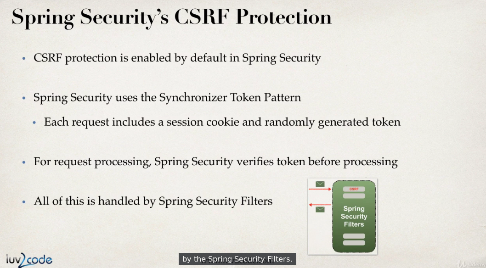

# Web secutiry

*  Для веб-приложения нужно добавить в CP: core,configuration,web.
* Principal - главный, основной - это некая сущность - пользователь, сервис, устройство.
* Web-безопасность в спринг реализована
как набор web-фильтров. DelagatingFilterProxy направляет
все запросы в специальный бин (id = springSecurityFilterChain), в качестве которого обычно
выступает FilterChainProxy.
* FilterChainProxy направляет запрос в цепочку secutiry
фильтров Spring.

* DelagatingFilterProxy конфигурируется либо в web xml,
либо программно.
* Конфигурируем security в WebMvc-приложении:
```java
//конфигурация аутентификации и авторизации
@Configuration
@EnableWebMvcSecurity
//@EnableWebSecurity
public class SecurityConfig extends WebSecurityConfigurerAdapter {
}
//конфигурация фильтров безопасности спринг
public class SecurityWebAppInitializer
   extends AbstractSecurityWebApplicationInitializer {
}
```

* Возможно хранить аутентификационные данные в памяти (см код SecurityConfig), методы хранилища в памяти:

* Role это GrantedAuthority с префиксом ROLE_
* GrantedAuthority это некоторое разрешение или "право".
* UserDetailsService - это интерфейс, используемый для
поиска пользователей в некотором хранилище данных:
```java
public interface UserDetailsService {
    UserDetails loadUserByUsername(String username)
      throws UsernameNotFoundException;
}
```

* Можно использовать SpEL для конфигурации авторизации:


* CSRF - cross-site request forgery - если юзер залогинен на одном сайте, то можно отправить
потенциально вредоносную команду с другого сайта
на первый.
* По умолчанию в спрингах включена CRSF-защита
и каждая форма должна иметь поле, которое содержит
некий секретный токен:
```java
<inputtype="hidden"
  name="${_csrf.parameterName}"
  value="${_csrf.token}" />
```
* CSRF отключается в WebSecurityConfigurerAdapter.
* Можно использовать и базовую http-аутентификацию.
##### Spring And Hibernate Materials


* project-specific tasks (maven/security):<br/>
<span style="color:blue;">
spring-security-demo-01-base-app
<br/>
spring-security-demo-02-base-security
</span>


* Чтобы найти правильную версию для spring-security нужно:
  1. Найти желаемую версию <b>spring-security-web, spring-security-config</b> в search.maven.org.
  2. Посмотреть в pom.xml на какую версию spring framework он ссылается:


##### Configuring basic security

* Этот класс регистрирует security-фильтры spring:


* SpringSecurity работает на базе Http-сессий(JSESSIONID).
##### custom login form (security-demo-03)


* Security configuration:
  1. authorizeRequests() - ограничить доступ используя HttpServletRequest
  2. anyRequest().authenticated() - любой запрос должен быть аутентифицирован - т.е. пользователь должен быть залогинен
  3. loginPage("/showMyLoginPage") - показывать Login Page по этому адресу. Нужно создать соотв. контроллер.
  4. loginProcessinUrl("/authenticateTheUser") - на этот адрес LoginPage будет отправлять запросы на аутентификацию. Spring Security перехватит вызов по этому адресу и сверит имя юзера и пароль. Контроллер для обработки этого запроса создавать не нужно.
  5. permitAll() - все имеют доступ к LoginPage.


* Login Form должна:
  1. использовать метод post
  2. запрос должен посылаться на "/authenticateTheUser"
  3. нужно использовать Form-binding tag library
  4. поля имя пользователя и пароль должны иметь стандартные имена:username,password


##### adding bootstrap (demo-04)


##### logging out (demo-05)


##### csrf (demo-06)
* <b>CSRF (англ. Сross Site Request Forgery — «межсайтовая подделка запроса», также известна как CSRF)</b>
* Пусть Боб создал тег , в котором в качестве источника картинки указал URL, при переходе по которому выполняется действие на сайте банка Алисы, например:
Боб: Привет, Алиса! Посмотри, какой милый котик:
```html

```
* Если банк Алисы хранит информацию об аутентификации Алисы в куки, и если куки ещё не истекли, при попытке загрузить картинку браузер Алисы отправит куки в запросе на перевод денег на счёт Боба, чем подтвердит аутентификацию Алисы. Таким образом, транзакция будет успешно завершена, хотя её подтверждение произойдет без ведома Алисы.

* Распространённым способом защиты является механизм, при котором с каждой сессией пользователя ассоциируется дополнительный секретный уникальный ключ, предназначенный для выполнения запросов. Секретный ключ не должен передаваться в открытом виде, например, для POST запросов ключ следует передавать в теле запроса, а не в адресе страницы. Браузер пользователя посылает этот ключ в числе параметров каждого запроса, и перед выполнением каких-либо действий сервер проверяет этот ключ.

* Synchronizer token pattern (STP) is a technique where a token, secret and unique value for each request, is embedded by the web application in all HTML forms and verified on the server side.




* Spring Security автоматом добавляет токен (видно в исходниках страницы).
```HTML
<input type="hidden" name="_csrf" value="69fab7b5-2848-4d5f-a275-0ff80c862fac">
```
* Используя обычную веб-форму со включенной csrf-защитой и без добавленного вручную токена получим ошибку.
##### display userID and roles (demo-07)
* Spring Security имеет специальные теги для отображения имен и ролей пользователя.


```HTML
home.jsp

<%@taglib prefix="security" uri="http://www.springframework.org/security/tags" %>
...
<!-- show username and roles-->
User: <security:authentication property="principal.username"/>
<br><br>
Role(s): <security:authentication property="principal.authorities"/>
<hr>
```
##### Ограничение доступа на базе ролей (demo-07)


##### Custom access denied page (demo-07)


##### Displaying content based on roles (demo-07)

* Managers and Admins should see their specific content.


